# セッションマネージャ経由でSSH

[toc]

---

## 概要

WindowsからEC2インスタンスへセッションマネージャ経由でのSSHを行えるようにし、VSCodeのRemote SSHで接続する方法を記載します。  
基本的には以下のページと同様の内容です。  
https://dev.classmethod.jp/articles/ssh-through-session-manager/

## [前提知識]多段SSH

直接アクセスできないサーバへ踏み台を経由してSSHする際に使用する方法です。  
ProxyCommandを設定するとダイレクトにSSHしているかのように接続できるようになり、以下のようなメリットがあります。

* 接続の手間が減る
* SSHの設定をローカルに置いておける
* ファイルの送受信でいったん踏み台に置く必要がなくなる
* VSCodeのRemote SSHで接続できる


※参考リンク  
[https://dev.classmethod.jp/articles/direct-ssh-by-proxycommand/](https://dev.classmethod.jp/articles/direct-ssh-by-proxycommand/)

---

## [前提知識]セッションマネージャの仕組み

Systems Managerのエンドポイントに対してインスタンス（SSMエージェント）がポーリングしており、エンドポイントに`start-session`の命令を行うとインスタンスへの接続が確立します。  
パブリックIPを持っていないSSHのポートも公開していないインスタンスに接続することができ、セキュアな運用を行えるメリットがあります。  
ただし、ファイルの送受信が行えないなど、いくつかのデメリットが存在します。  
※AWS CLIを使う場合は、ローカルにAWS CLIとセッションマネージャプラグインを入れておく必要あり



※参考リンク  
[https://docs.aws.amazon.com/ja_jp/systems-manager/latest/userguide/session-manager.html](https://docs.aws.amazon.com/ja_jp/systems-manager/latest/userguide/session-manager.html)

---

## セッションマネージャ経由でのSSH

セッションマネージャで接続したインスタンスから自分自身にSSHすることで、セッションマネージャと多段SSHの仕組みを併用した接続を行います。  
この接続方法を利用すると、セッションマネージャのメリットとSSHのメリットの両方を享受でき、デメリットをほぼ無くすことができます。  
具体的には以下のようなメリットがあります。

* セッションマネージャのメリット
    * パブリックIPが不要
    * SSHポートの公開が不要
    * ログをS3に残せる
    * IAMで認証認可を行える
* SSHのメリットで打ち消されるセッションマネージャのデメリット
    * SCPでファイルの送受信ができる
    * VSCodeのRemote SSHで接続できる
    * タイムアウトしない
    * 接続するユーザを指定できる



ただし、以下の要件が必要になります。

* ローカルにSSHを行えるクライアントを用意しておく
* ローカルにAWS CLIをインストールしておく
* ローカルにセッションマネージャプラグインをインストールしておく
* IAM Userにアクセスキーを作っておく
    * AWS CLIを使うために必須
* **ローカルにSSHキーを管理しておく**
    * 下記の方法で排除可能

### SSH Configの書き方

事前にWindowsにAWS CLIとセッションマネージャをインストールし、`aws ssm start-session`を使ってインスタンスへ接続できることを確認しておいてください。

```
Host YOUR_INSTANCE_ID
    HostName YOUR_INSTANCE_ID
    IdentityFile ~\.ssh\ssh_over_session_manager_key
    User ec2-user
    ProxyCommand aws ssm start-session --target %h --document-name AWS-StartSSHSession --region YOUR_INSTANCE_REGION
```

---

## キー管理の排除

上記の**ローカルにSSHキーを管理しておく**は明確なデメリットですが、以下の方法を利用することで管理を不要にできます。  
AWS CLIのコマンドにはローカルのSSHキーをインスタンスに配置するコマンド（`aws ec2-instance-connect send-ssh-public-key`）があり、
これを実行することでキーペアを作成していないインスタンスにもSSHキーの配置が行えます。  
また、このコマンドで配置したキーは1分間しか利用できない制限があるため、必然的に毎回接続のたびにキーを配置し直す必要があり、これによって実質的にキーの管理が不要になります。  
キーは既存のものを使い回しても問題ありませんが、使い回すメリットはとくにないため、毎回生成を行うのがよいかと思います。


